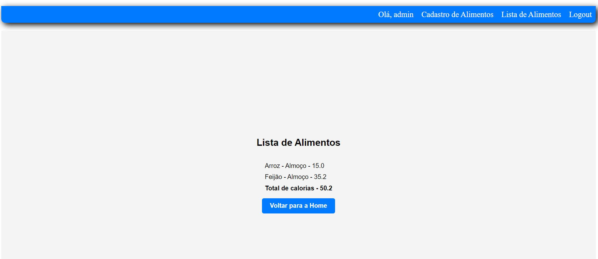

# Projeto Calorie Tracker



Digital healthcare solutions are a necessity in today's world. This simple Calorie Tracker web application is designed to help users keep track of their calorie intake and nutrition. It allows users to log their food items, view the nutritional breakdown, and track calorie goals.

## Features

- User Authentication: Users can create accounts, log in, and log out securely using Django's built-in authentication system.

- Calorie Logging: Users can add food items they've consumed, specifying the food's name, description, and calorie count.

- Nutritional Breakdown: The app calculates and displays the total calories consumed for the day, along with the breakdown of nutrients.

## Technologies Used

- Django: A high-level Python web framework that makes it easy to build web applications.

- Django Authentication: Built-in authentication system for user management.

- HTML/CSS: Front-end design and user interface.

- SQLite: A lightweight database system for storing user data and food item records.

## How to Run the Project

1. Clone this repository to your local machine.

```bash
git clone https://github.com/your-username/calorie-tracker.git
cd calorie-tracker
```

2. Install the project dependencies.

3. Apply database migrations.

```bash
python manage.py makemigrations
python manage.py make
```

4. Create a superuser for accessing the admin panel.

```bash
python manage.py createsuperuser
```
5. Start the development server.

```bash
python manage.py runserver
```
6. Access the web app in your browser at `http://localhost:8000`.

## Usage

1. Create a user account or log in with an existing one.

2. Navigate to the "Cadastro de Alimentos" page to add food items you've consumed. Provide the food's name, description, and calorie count.

3. View the "Lista de Alimentos" page to see a list of food items you've logged, along with their calorie counts.

4. The app will calculate the total calories consumed for the day and display the nutritional breakdown.

## Contributing

Contributions are welcome! Feel free to open issues or submit pull requests to improve the project.

---

**Note:** This project is for educational purposes and not intended for production use. It's a part of my Python Django projects compilation inspired by real-world applications.


